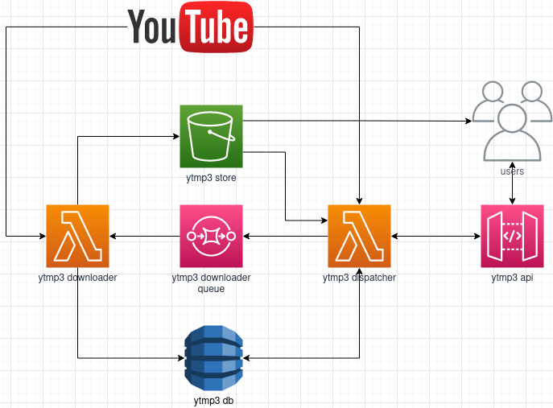

# ytmp3 cloud
The cloud-based YouTube to mp3 host/converter

## Overview


## Prerequisites
- bash
- wget
- docker
- make
- awscli (with admin account)
- samcli

## Setup
Choose a unique bucket name
```bash
echo ytmp3-cloud-"$(tr -dc a-z0-9 </dev/urandom | head -c 13 ; echo '')"
```

Set `YTMP3_STORE_BUCKET_NAME` in scripts/deploy.sh

Run the deploy script

**Note:** this creates an ECR repository outside of the stack, since sam cannot build images yet. If you know a way around this, please submit a pull request!
```bash
make
```

## Clean
Clean up build files during or after development
```bash
make clean
```

## Destroy
Run the destroy script
```bash
make destroy
```

## REST API
The REST API URL will be `Ytmp3ApiUrl`, output from ./scripts/deploy.sh

### GET /mp3/{videoId}

#### 400 Invalid videoId
```json
{
    "error": "Invalid videoId"
}
```

#### 400 Download failed
```json
{
    "error": "Failed to download #########, please try again later",
}
```

#### 200 Download pending
```json
{
    "videoId": "#########",
    "status": "PENDING",
    "updatedAt": "2023-04-23T19:27:44.850Z",
    "createdAt": "2023-04-23T19:27:44.850Z"
}
```

#### 200 Download complete
```json
{
    "videoId": "#########",
    "status": "COMPLETE",
    "url": "https://##########.s3.#########.amazonaws.com/0Sl5-Cl6LOo.mp3",
    "updatedAt": "2023-04-23T19:27:44.850Z",
    "createdAt": "2023-04-23T19:27:44.850Z"
}
```

## Contributors
Contributions are most welcome, please feel free to submit a PR!
